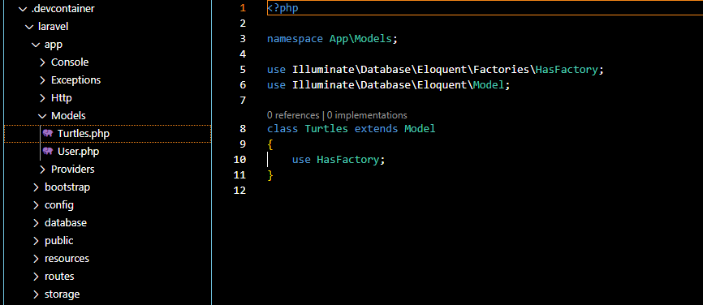
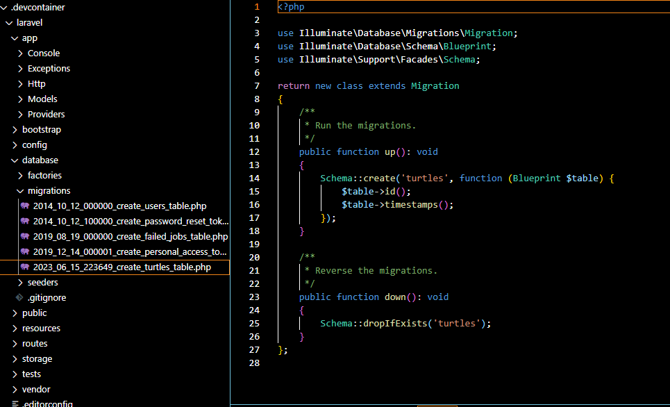

# Teorihandboken - Backendutveckling (BE)
Studerande: Vincent Wigardt

## BE 1.1 PHP

PHP är en typ av serverbaserat språk som är uppfanns av Rasmus Lerdorf 1992, med motivet att se vem vilka som tittade på hans cv under den tiden.
Eftersom att PHP är ett serverbaserat språk så måste man ha en koppling till en server för att syntaxen ska fungera, den kan man använda sig av en webbserver eller lokal server som då Docker kan skapa vilken typ av lokal server som helst eller XAMP, LAMP, LEMP osv.

Men för att en fil ska identifieras som PHP måste man deklarara den som en PHP fil och det gör man när man skapar filens namn. som te.x index.php eller firstpage.php osv

För att skapa ett php script i koden kan man då skriva "<?php> "ens commando" ?>" och därav är sektionen från första taggen till den sista deklarerad som PhP och en annan funktion som detta språket har är att det kan skrivas med HTML och dess struktur som i exemplet nedanför.

Syntaxen i PHP kan ser ut så här. 

Som vi ser i bilden ovan kan vi se att det är en HTML struktur men längst ner i bodyn är ett PHP script integrerat och just kommandot echo skapar då ett echo till webservern och servern returnerar texten "Hello World!"

I nästa exempel kommer jag att visa hur man en variabel som är då red "red", i php skapar man en variabel med tecknet "$" som i mitt exempel nedanför kommer jag att deklarera denna variabel till en sak en sak som är viktigt med är att PHP är ett case sensitive språk så om man skriver i någon annan typ än den typen som är deklarerad som kommer det inte att fungera.

I detta exemplet lämnar jag det sista ordet i slutet som en variabel i mitt echo som gör det sista ordet blir variablen, men för att jag inte hade samma casesensitivity så är bara "My car is red" som fungerar.

Men det gäller ej commandon, i detta exemplet ska visa att man kan ge commandon oavsett val av stora eller små bokstäver i commandot.

Koden kan köras utan några konstigheter!

Nu i nästa exmepel ska vi gå igenom IF statments som är möjligt i PHP

Så i detta exmpelet så kan man ge ett resultat baserat på vilken tid det är på servern. som då $t är deklarerat till date("H") och om klockan är mindre än 20 / åtta så kommer ett echo som säger "Have a good day!"

## BE 1.2 OOP i PHP

Från PHP5 can du nu skriva PHP kod i en objekt orienterad stil! så vad är OOP? OOP vilket betyder Object-Oriented Programming och tanken är att man inte ska behöva repetera sig själv eller inte slösa en massa tid på att skriva alla typer av data som kan redan vara deklaread som en class och få ut objekten i klassen. Vilket gör prossesen att skriva kod blir snabbare om du bara behöver göra en klass och deklarare objekten bara en gång än tusengånger för var gång som du behöver objekten.

Så i detta exmpelet kommer jag deklarera en klass i som då kallas för "Transformers" och i den klassen kommer jag inkludera properties som då $name och methoder som funktionen set_name som lägger namnet på variablen och en return funktion som visar resultatet!

I nästa exempel så kommer jag återanvända Transformer klassen som en mall som inkapslar egenskaper och beteendet då jag återanvänder klassen Transformer och dess properties för name och faction och methoder för att få namnet och factionen och att få dom att presentera sig. construct() ör en method som man använder när ett objekt ska skapas i detta fall tar den två argument då name och faction och sedan till delar värdet för både namn och factionen. get_name methoder ger namnet $name och $get_faction gör det samma för $faction. 
introduce är en method som använder name och faction väret för att presentera var inviduell Transformer med echo.

Därav så har Transformer klassen olika namn och factions. Senare implementeras en if-sats för att se om variablen $starscream har namnet Starscream och om det stämmer triggar det introduce() för honom och sedan gör alla andra Transformers det.

Här är resultat av allt:

## BE 1.3 Säkerhet i PHP

PHP är ett känt språk när det kommer till webbsäkerhet eftersom att språket har en massa olika typer av säkerhetsfunktioner, men vi kommer gå igenom ett av nätverken till PHP som kallas då för Laravel! Laravels syfte är att göra autensering väldigt enkelt och bara med det ramverket som kommer med konfigurerat och klart och finns i app/config/auth.php som innerhåller många väldokumenterade alternativ för autensering.

Laravel innerhåller en usermodel i app/models som används med Eloquent-authenticationdriver glöm inte att bygga schemat för denna modell och se till att lösenordsfältet är minst 60 tecken.

Om du inte använder Eloquent kan du använda databasautentisering använder Laravels query builder.

Glöm inte att göra en dom sträng i databasen för remember token som laravel genererar och lagrar som "remember me"
 som ska vara med vid migrationen för att komma ihåg användaren.

Som det visar sig i bilden så har jag inkluderat en $table->rememberToken(); som är viktigt att ha vid migrationer.

Laravel har även tillgång till en massa paket för enkel använding med färdiga modeller och säkerhets funktioner, som till exempel Laravel Sanctum som är ett lätt autentiseris system för applikationer med en sida SPA (single page application), mobila applikationer som kommer med en token baserad API. Sanctum tillåter användare att att generera många API tokens i deras konto. Laravel Sanctum ger en funktion att lagra användares API tokens i ett databas tabell och authentiserar inkommande HTTP förfrågningar via Authorizaton headern vilket ska ha en godkänd API token som gör det lättare att skapa och arbeta med autentisering!

Laravel har många andra paket för ramverket som Passport, Socialite, Laravel Mix och mera. mer info finns i länken nedan om installation av Laravel och allmän info om ramverket!

https://laravel.com/docs/10.x/

## BE 1.4 MVC

MVC står för Model, View och Controller som ingår i ramverket Laravel och det är en designmönster där du använder Modellen för att intragera med databasen och få objectens infromation
Views renderar sidorna i applikationen och Controllers hanterar användar förfrågningar och tar emot data från Modellerna även Routes används för att kartlägga URLens utsedda kontroller.

En förfrågan görs närt en användare skriver en URL assosierad till applikationen, en route kopplad med en URL kartlägger URLen till en controller handling, den controllern agerar till den modellen som den är kopplad till och får information från databasen och sedan skickar data till View och sedan renderar View resultat!

För att skapa en modell i Laravel skriver man $ php artisan make:model Turtles --migration

Och det skapar en modell som heter Turtles.php som ser ut så här som ligger i Models mappen.

När jag skapade modellen med php artisan make:model Turtles --migration, eftersom att jag använde kommandot --migration så generade den även en migrations fil i migration mappen med namnet [timestamp]_create_turtles_table.php som skapar en turtles tabell i databasen med ID och timestamps! som vi ser på bilden nedanför.

Om du vill migrera fler tabeller till databasen tar du dig hjälp av Schema:: funktionen där du kan definera data typerna som tabellerna ska ta emot. Som i detta exempel.

Efter detta steg skriver man php artisan migrate för att migrera dom nya tabellerna till databasen.

Och för att skapa en controller till den nya Modellen skriver man bara php artisan make:controller TurtlesController och det kommer skapa en Controller som kommer finnas i Http/Controllers/TurtlesControllers.php som kommer att ge denna fil.

Därav definerar man rotues genom att lägga till Route::resource och vad man vill ha och vilken Controller den ska till och sedan definerar man Routsen i View som finns i resource mappen.

Så sammanfattningsvis så gör Model komponänten att man kan kontrollera applikationens databas och är den ända komponänten som kör, tar emot, updaterar, skapar och tar bort data.

View componänten genererar och renderar en UI för applikationen som kan vara gjord av HTML/CSS eller Javascript och den tar data ifrån Controllern som får sin data ifrån modellen som kör i samman datan med HTML strukturen för att skapa en UI! Controllen agerar som en medlare mellan View och Model.

## BE 1.5 Wordpress

Wordpress är en populär webbhosting plats som har funnits sedan 2003 och har gett bra tillgänglighet till användare som inte kan skriva kod till experter som använder den på grund av enkelheten till funktionaliteten och ligger till mer än 34% av alla hemsidor på nätet. Eftersom att det ger vem som helst förmågan att kunna ha en dynamisk hemsida med både backend och frontend utan att ha någon förkunskap så tillgängligheten är stor. Wordpress kan erbjuda massvist med funktioner som gör att du kan välja bland en massa teman till din hemsida, det finns Plugins som kan ge dig en moduler till din hemsida som till exempel en Email plugin som gör att om någon skriver i ditt form på din hemsidan och skickar det så kommer det direkt till din kopplade mail. Wordpress hemsidor är även Search Engine Optimization (SEO) "Sök motor optimiserat" som gör det lättare för dig att synas på nätet. Wordpress är multilingual som tillåter användare att översätta innehåll till andra språk!

Den ger även en kontrollpanel för admin så dom kan hantera användare, roller, behörigheter samt blogg inlägg.
Wordpress största styrka ligger i deras användarvänliga mall system eller “themes”
Som gör det lätt för användaren att ändra utseendet på hemsidan och justera funktioner utan att behöva skriva någon kod.
Många Themes finns tillgängliga gratis men det finns även ett stort utbud som går att köpa via olika externa hemsidor.

Wordpress använder sig av PHP som programmeringsspråk och MySQL eller MariaDB för databashantering.
Wordpress kan köras på en vanlig persondator med deras egna mjukvara eller via en webb-server.

I bilden ovan kan man se den användarvänliga UI med en kontrollpanel för webbsidan!
## BE 1.6 Heirarkiska databaser

Den Heirarikisk databas var den första typen av databas, den skapades på 60 talet. Denna databashanterings modell som är strukterat som ett som ett träd med grenar där strukturen är från förälder till barn, därav en hierkisk struktur med överordnnader och underordnade relationer.
I en sån databas finns det data med uppsättningar poster, som kan vara relaterade till varande antingen under eller över. Varje post i databasen kan ha flera under poster men bara en över post. Vilket betyder att det finns en förälder-barn-relation som binder posterna tillsammans, då att en post är antigen en förälder eller ett barn eller båda. Om man tänker sig en heirkisk databas som en organisation där den som är högst upp är ägaren till den och allt under representerar olika avdelningar som försäljning, ekonomi, marknadsföring osv, men att i varje avdelning så kan man ha en överordnad och flera under ordnand som är överordnad till deras underordnader.

Fördelen med denna typ av databas modell är att den är effektiv för att handskas med data som har en naturlig hierkisk struktur, som i en organisationsstruktur eller produktstruktur, det gör det lättare att navigera och leta efter data i databasen eftersom att relationerna är väldefinerade och tydliga som gör att det går snabbt eftersom att det är uppdelat i en Heirarkir. 

Men det finns begränsningar när det gäller flexibilitet och skalbarhet eftersom att systemet är i levlar och relationer så kan det vara svårt och kräva stora anpassningar i databasstrukturen om ett projekt kräver en struktur som inte är som denna.

Man kan se denna databasstruktur i till exempel webbshoppar som är uppdelat i många kategorier med över och underordnader.

Bilden ovan visar ett bra exempel på en Heirkisk datorstruktur!

## BE 1.7 Relationsdatabaser, SQL och ER-modellering

Relationsdatabaser är en typ av databashanteringsmodell som är byggt på en relationell algebra och även används för att handska och kartlägga strukturerad data. I en relationsdatabas delar man upp data i olika tabeller, varje tabell har en entitet och varje rad i då tabellen representerar del av entiteten genom kolumnerna som definierar egenskaper för entiteten.
En ententitet representerar en tabell med objekt. Entiteter brukar object som är definerade av klasser med variabler som lagrar värden av enkla object som representerar viktig data struktur i applikationen.

Man kan skapa en relation mellan tabellerna i 3 olika format antigen One-to-Many är en relationstyp där the One är en entitet och Many är flera och man kan se det som en skola där läraren är the One och studenterna är Many.

Many-to-Many är en typ av relation i databasen där en entitet har koppling till många andra. till exempel Spotify har mycket musik som kan vara assosierade till många spellistor låt entiteten och spellists entiteten har en Many-to-Many relation eftersom att en låt kan vara en del av många spellistor och en spellista can ha många låtar.

One-to-One relation är en relation med två entiteter som är kopplade till varandra och ingen annnan förutom varandra, Där en entitet kan vara ett land och den andra entiteten huvudstaden.

För att hantera en relationsdatabas användar man sig av SQL (Structured Query Language) en av vanligaste programmeringsspråket vid relationsdatabashantering. Med SQL kan man göra olika operationer i databasen som kan vara lägga till data, uppdatera data eller skapa tabeller eller söka efter den, vilket gör språket användbart för att handskas eller ändra data.

ER-modellering "EntitetsRelations-modellering" används som en grafisk design för att se hur databasstrukturen skall vara med olika entiteterna, attributer och relationerna till varandra.

Man börjar med att ta reda på vilka entiteter man ska ha i sitt ER-Diagram där efter ger man dom deras attributer och sedan relationerna till varandra.
i bilden nedan visar hur en relations databas kan se ut.

Entiteterna är Rektanglarna, Attributerna är ovalerna och Relationerna är Rutorna mellan Entiteterna.

## BE 1.8 OAuth i backend
OAuth (Open Authorization) är en autentiseringsprotokolls method som skapades 2007 och används för säker authorisering på webben via klientapplikationer som Youtube, Google och mer.
OAuth ger tillgång till resurser från en klientapplikation till en serverapp där den kan få användarens infomation. Oauth är bra method för säkerhet eftersom att den lagrar unika access tokens för varje användare. Med oauth behöver man inte langra sin personliga infomation på mer än ett ställe eftersom att man kan logga in nu mera genom till exempel google och detta är möjligt pågrund av API-nycklar från andra dom tjänsterna som man vill authorisera sig genom.

I OAuth finns det vanligtvis tre olika parter då Användaren(resource owner), Klienten och Autentiseringsserveren. OAuth används i Sociala medier som för att ge möjlighet till att logga in på en tredjepartapp, där använderaren kan dela sin profildata eller göra åtgärder utan att dela sina lösenord. OAuth används även för API-åtkomst många API-tjänster samt plattformar har OAuth för att ge programmerare tillgång till sina APIer, Cloudtjänster som ger användaren tillgång till sitt cloud utan att kräva deras lösenord och det ger användare möjlighet att kontrollera åtkomsten genom tredjepartsappar. OAuth används även inom e-handel och andra betalningsportaler för kundinfomation, försäljningsdata och betalningshantering och det gör det smidigt för trygg och säkera betalningar via webben.

I Laravel finns det inbyggda paket och funktioner som gör det lättare när man ska implentera OAuth i sin applikation. Ett av dom paketen heter Laravel Passport som ger till gång till OAuth servern till applikationen, man kan ladda ner det här paketet via composer. som man gör med kommandot i root mappen 'composer require laravel/passport' i terminalen.

## BE 1.9 HTTP-protokollet

HTTP då Hypertext Transfer Protocol gör det möjligt för klienter och servrar att kommunicera data via webben. Det gör man med olika kommandon och methoder som man kan köra via applikationen Insomnia som är en HTTP klient. Det gör det möjligt att testa eller felsöka HTTP-requests och svar. Med detta verktyg kan jag enkelt skicka HTTP-förfrågningar till server och få svaret av den. Låt oss gå igenom lite kommandon:

GET: hämta data från en server

POST: skickar data till en server för att skapa en ny resurs, till exempel inloggnings info.

PUT: skickar data till servern för att updatera eller skapa en ny resurs.

DELETE: tar bort resurs från servern

PATCH: updaterar en specifik resurs och skickar bara den ändrade infomationen.

Dessa komandon används vanligtvis med en URL som hittar resursen som begärs eller manipuleras. Det är viktigt att komma ihåg att olika hemsidor och API:er kan ha sina krav på hur olika HTTP-kommandon ska hanteras, därför är det viktigt att läsa documentationen om hemsidan eller API:et för att förstå hur det fungerar.

I denna bild visar jag hur jag får tag i alla fictionella böcker ifrån simple-books-api där jag lägger in URL i en get request och därav fyller jag ut QueryParametrarna med type och värdet fiction. därav får jag ut alla fictionella böcker på API:et

        Viktiga server koder

    Informational responses ( 100 – 199 )
    Successful responses ( 200 – 299 )
    Redirection messages ( 300 – 399 )
    Client error responses ( 400 – 499 )
    Server error responses ( 500 – 599 )

## BE 1.10 cURL
cURL står för client URL det är ett kommandoverktyg som har ett biblotek som änvänds för att kommunicera med servrar och protokoll av olika typer med kommandon. cURL gör det möjligt att utföra olika typer av operationer som relaterar kring nätverk som att skicka HTTP requests, hämta viler genom FTP eller kommunicera med API:er. cURL stöder många protokoll som HTTP, FTP, IMAP och många fler, som gör det väldigt användbart. cURL ger användare förmågan att välja olika parametrar och annat för att anpassa sina requests. cURL kan även hantera tankning av data eller uppladdning av den, hantera cookies, sessions och hantera SSL/TLS-krypteringar. cURL finns även också tillgängligt i olika programmeringsspråk som till exempel PhP.

I Laravel används cURL-bibloteket som HTTP-klient som därav kan göra requests till externa resurser som då till ett API. Laravel har ett API med cURL som används is HTTP-facades och andra hjälpmedlen, eftersom att cURL följer med i installationen av PHP. Med kommandonen vi lärde oss i den föregående spalten HTTP så kan vi skriva dom direkt i Laravel och få resultatet. Det kan se ut såhär

Så i den här bilden så görs en GET user request.

Coola tricks man kan göra med cURL!

Med detta kommandot i din cmd terminal kan du se vädret! det är bara att skriva staden med stora bokstäver efter.

curl http://wttr.in/STOCKHOLM

För att ladda ner fler saker samtidigt med cURL ser kommandot ut så här:

curl -O file1.txt -O file2.pdf -O file3.zip

Så sammanfattnings vis så är cURL något som används som HTTPklient man kan ladda upp och ner filer, och det stödjer många olika protokoll och stödjer många programmeringsspråk så som PHP, C/C++, Python och Java!

## BE 1.11 REST

REST betyder "Representional State Transfer," där datan är uppdelat i olika resurser och dessa resurser kan vara tjänster, objekt eller data. och var resurs har sin egna unika URI (Uniform Resource Identifier) och varje resurs har sitt unika State/Tillstånd som tolkas med olika representationer som kan då vara JSON eller XML.

REST har en viktig princip är att dom måste följa ett viss typ av standardiserade methoder för att få tillgång till resursen och en method kan vara HTTP methoden deras kommandon GET, POST osv för att kunna utföra operationer på resurserna. För att förtydliga REST är inte beroende av HTTP protokollets kommandon allt beror på vilken protokolls typ som RESTen är skrivet i. 

Stateless betyder att servern inte lagrar inte klientens status som betyder att varje request/förfrågan måste innehålla endast nödvändig infomation för att förstå och sedan förfrågan vill.

Client-Server Architektur betyder att klienten och severen är separata entiteter som kommnicerar med varandra genom nätet, där klienten gör förfrågningar till servern och sedan processar servern var förfrågan och sedan returnerna ett svar till klienten.

Uniform Interface gör att APIn följer en uniform interface vilket betyder att vilka methoder för varje operation som kommer att fungera.

Så för att identifera uniformen i REST:APIen måste du följa då ett par olika aspekter för att få fram den. Resurs identiferar för varje resurs i din API måste ha ett sätt att identiferas igenom en URL och där av ger URL:en är slutpunkt/endpoint var resursen, och där av kan man bestämma sig vad man vill göra med resursen genom vilka methoder som resursen kan förstå. för att kart lägga methoderna i den specifika URLen måste du identifera hur klienten kommunicerar med resurserna. För att se om protokollet är HTTP baserad så kan man kolla status koden. Då Rest APIet är mellan hand för klienten till servern och sedan till databasen.

## BE 1.12 XML och andra dataformat

XML som då betyder Xtensible Markup Language är ett vanligt dataformat som representerar data i en form som både människor och maskiner kan läsa. XML är en data typ som har stängnings taggar där varje tag representar ett element och elementen har attribter som kan ha text ekller andra invirade element här är ett exmpel på ett XML dokument.

Så i detta XML exemplet visar att all information om John Doe som visar att han är först en person som sedan identiferas med sitt namn, sin ålder och sedan sin adress. men huvud klassen i denna resurs är person klassen.

Ett annat typ av dataformat kan vara JSON (JavaScript Object Notation) och JSON är då baserat på Javascript objectiv syntax som representeras datans nykelvärden i arrayer och det kan se ut så här i ett JSON objekt.

Och som vi ser är formatet väldigt likt varandra. Nästan alla språk kan förstå JSON.

Nästa värde som vi ska gå igenom heter CSV(Comma-Separated Values): CSV skrivs i vanligt format men använder sig av tabell data i sin representation och varje CSV fil representerar klasserna och sedan objekten med dom på nästa rad och det kan se ut så här!

CSV används ofta för import/export och data utbetyden mellan olika typer av system. CSV kan användas av nästan alla programmeringsspråk som har sina biblotekt eller en inbydd funktion för att läsa formatet.

Nästa format är YAML som står för YAML Ain´t MARKUP Language och används i komplex tata struktur med listor och nästade objekten och använda för att konfigerara filer eller data komunikation. och ett sådant format kan se ut så här:

## BE 1.13 Webbservrar

En webbserver är en appliktation som hanterar HTTP (Hypertext Transfer Protocol) förfrågningar och leverar webb innehåll till klienter runt om hela världen och agerar som märgben för världswebben och gör utbyttet av information mellan servern och klienten. En primär funktion är att ta emot inkommande förfrågningar från klienten och sedan returnena i resurserna till klienten. Webbservrar finns i två olika kategorier där en av dom kallas för traditionell webserver/applikationsserver som kan vara A pache HTTP server eller Nginx som har fokus främst på att ge statiska filer och hanterar grundläggande HTTP-requests och det ger bra skalbarhet och är optimerat för att leverera stistiskt innehåll effektivt.

Den andra typen är applikationsservrar som JBoss, Tomcat eller MIIS (Microsoft IIS) designat för applikation eller skript som är på serversidan som ger mer funktionallitet som stödjs för att köra dynmaiska applikationer på webben med språk som Java, .NET eller PHP. En applikationsserver har oftast funktioner för sessionhantering, lastbalansering, databasanslutning med mer.

Webbservrar har en stor roll för att säkerställa säkerheten för applikationer på webben som som kan ge åtkomstkontroll för auktoriserade användare och hantera kryptering med hjälp at SSL/TLS-protokollen för att ge säkra anslutningar och även så webbservrar integreras med funktioner som inbrottskydd, brandväggar och andra säkerhetsåtgärder för att skyyta mot attacker eller preventera dom.

Webbservrar är en viktig del av internetinfrastrukturen som gör leverans av webbinnehåll och applikationer till klienten/användaren genom att hantera förfrågningar, handskas med data eller säkerställa säkerhet samt ge skalbarhet som gör dom grundläggande del av vårat webbwekosystem ute på nätet!