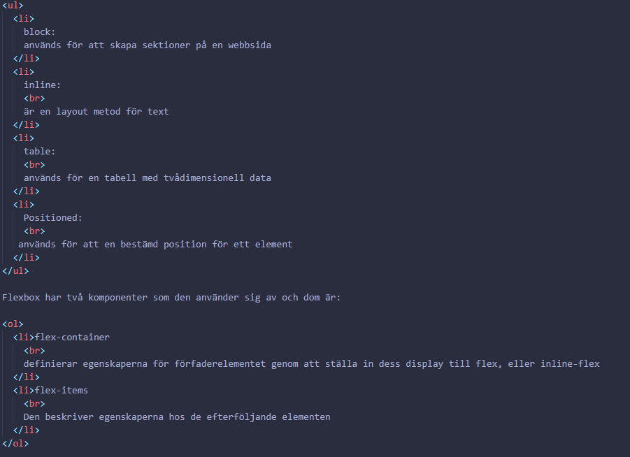
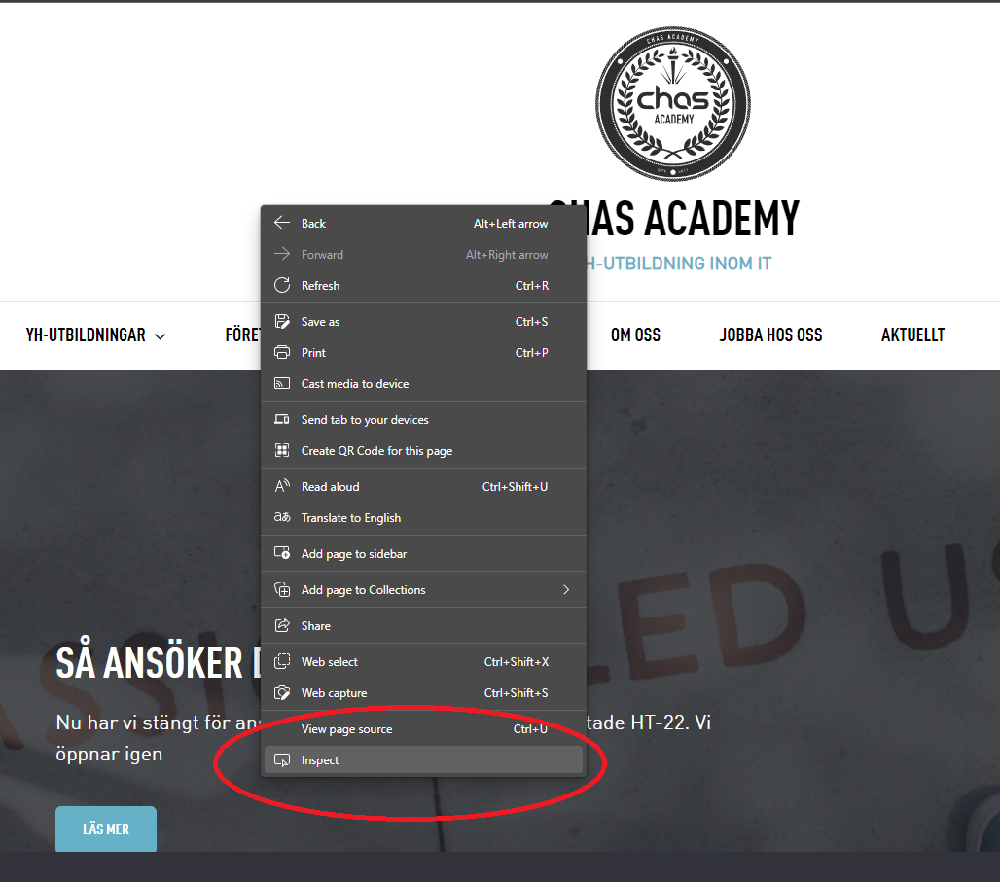
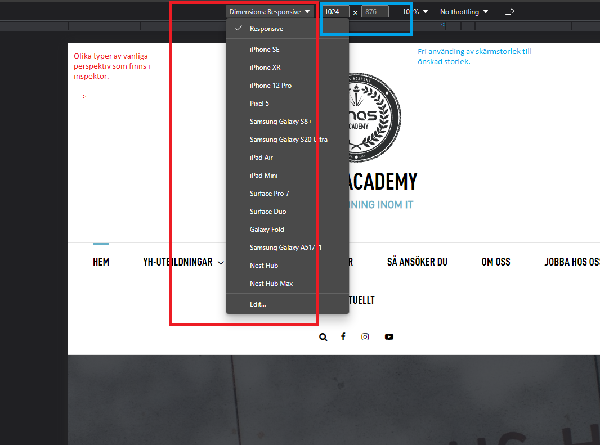

# Teorihandboken - HTML & CSS (HC)
Studerande: Vincent Wigardt
<pre>
# HTML
HTML står för Hyper Text Markup Language och är standard byggblocken för att bygga sidor på webben, HTML beskriver textens struktur där strukturen går från uppifrån och ner av en serie av element
Ett element är byggsten med en ettiket som visar vad den har för syfte i strukturen och deklareras med en början, ett innehåll och ett slut. 

Till exempel: i en början = <>, informationen imellan och ett slut = </> 

Till exempel: <h1>Heading</h1>-->

<h1>Struktur</h1>

``
 
Här är en typisk basstruktur i HTML

<pre>
<html>
<head>  <--- Head är där man lägger till all information om HTML documentet som: "Page title" nedanför. versionen av h
<title>Page Title</title> <
</head>
<body>
<h1>This is a heading</h1>

This is a paragraph.

This is another paragraph.

</body>
</html>
</pre>
</code>
``
href gör så att man kan lägga till bilder-->

<h1>ELEMENT</h1>

Element i HTML är inom dessa taggar <> och det är med i följande struktur.

``<h1 id ="headline">Hejhej</h1>``

Elemennt har oftast olika attributer där den vanligaste är 'class' eller 'id' dessa använder vid styling eller för att ändra något i DOM:en med JS (JAVASCRIPT) tillexempel. Många element kan ha likadan 'class' men 'id' skall vara eget.
id kan man använda i en class om man skulle vilja just plocka ur ett visst element utan att skapa en ny egen 'class'.

`<h1 id ="headline">Hejhej</h1>`

Element finns det olika typer vilket innehållet av gör om det är en `<li></li>` tagg för listor och därav `<a>` taggen för länkar. det finns många olika taggar men det som förekommer mest är `

` det är svårt att arbeta med ett namn som förekommer fler än en gång där av element som är semantiska. Ett samantiskt element ser vi vad dom gör i deras element t.ex

`<header></header>` <-- Det som är högst upp på sidan. tex sidans namn.
`<section></section>` <--- Viss del av sidan
`<nav></nav>` <--- 
`<article></article>` <-- Text om något.
`

` <-- en paragraf används för att skriva något.
`<btn></btn>` <--- ett knapp element.
 `<fotter></fotter>` <--- längst ner``

 Semantiska används istället för element som `

` och `` där inspectorn vet vad som är vad och det gör det lättare att söka.

 
 
 Olika typer av Element

 Block kommer med en default padding och margin

  Exempel

 `

` - blockelement
 `<ul></ul>` - unordered list; punktlista
 `<ol></ol>` - ordered list; numrerad lista
 `<li></li>` - listelement (punkterna listor)
 `<h1></h1>` - headline/rubrik element (up till h6)
 `

` - paragraf

 Inline har ej någon default margin och används inne i blocken
 
 Exempel

 `` - allmän inlinelementt
`` - länkar
 `<b></b>` - fetstilt för text
 

<h1>Entiteter</h1>

'<' - mindre än
'>' - mer än
'&' - ampersand (och)
'  ' - space/mellanslag för att ta ett stegframåt i raden utan radbyte

 <h1>Övriga kommandon</h1>

 `<!---->` - En kommentar

<h1>Tabeller</h1>

Tabbeler använder en typ av struktur och syntax, en viktig grej för semantik och även styling.

Exempel på olika tabelfunktioner

`<table></table>` - rotelement för tabellen
`<thead></thead>` - table head
`<tr></tr>` - table row som får tabbelen att gå i en horizontell rad.
`<td></td>` - tablens data

<h1>Scope</h1>

Attributen ("Egenskapen") scope anger titeln på rubrikcellserien, raden, kolumnen eller radgruppen.

Exempel på Scope

<td scope="rowgroup"<>/th>

<h1>Olika grupper för listor</h1>

'row' -  En horizontell rad.
'col' -  En vertikal rad.
'rowgroup' - Listgrupp i en horizontell rad.
'colgroup' - Listgrupp i en vertikal rad.

<h1>Attributer</h1>

Enheterna kan också ha olika storlekar, dvs över flera rader eller kolumner. Använd sedan attributen rowspan="<tecken>" och colspan="<tecken>" .

<h1>Formulär</h1>

Formulär är mycket vanligt och används i många olika situationer på webben men det ger användaren för sidan en möjlighet att skriva någonting som då kan vara kanske inloggningar på sidor med inloggningsfunktioner för användare, nyhetsbrev, kommentarsfält och mycket mer.

I likhet med tabeller används även speciella element och attribut för tabeller. Rotelementet i formuläret är "<form>", "<input>" används för inmatningsfältet.

Källa 1 HTML - > https://www.w3schools.com/html/html_form_attributes_form.asp

## HC 1.1 HTML & CSS

<h1>CSS</h1>

Cascading Style Sheet eller CSS är språket som HTML stylas med. I browsern kombineras HTML och CSS till Document Object Model eller DOM:en som sedan visas för användaren och CSS ger friheten till att göra mycket möjligt i HTML som te.x ändra storlekar, position, färger och typsnitt med hjälp av CSS.

Hur man får ens CSS and intragera med ens HTML är att man måste länka sitt CSS blad i sin HTML kod, så att dom är samman kopplade vilket man skriver i sin HTML i en metatagg och då '<link>' (länkar exempel finns i Exempel bild 1 nedan) HTMLEN och CSSEN tillsammans!

För att göra en kontroll att dom är länkade lyckades och HTML intragerar med CSS'n använder du dig av ett HTML element som då '<h1></h1>' ge ger den en färgen blå som i 'Exempel 2'

Exempel 1 BILD -->> 

   

Exempel 2

HTML                  CSS

<h1>Hello</h1>        h1{
                        color:blue;
                          }

<h1>Syntax</h1>

Syntaxen funkar med

Selector tex = h1

Deklaration  = {} där man har tex Propertys, Values i och det fungerar på detta sätt!

h1 { color:red; font-size: 16px;}

Propertyn i denna deklaration är då color och den har en color syntax där man kallar på value (värdet) red; (röd) och det gör texten röd.

Och samma är det på font-size där text propertyn till textstorleken kallas och sen deklareras det till 16px; eller pixlar i storlek.

<h1>Kommentar</h1>
*/ */

Exempel

` /* Detta är en kommentar */`

         
<h1>CSS Prioritering</h1>

Vilken stil används när flera stilar anges för ett HTML-element?

Alla stilar på sidan kommer att "kaskadas" till en ny "virtuell" stilmall enligt följande regler, där den första har högsta prioritet:

    
Prioritering

    Inline-stilar (i ett HTML-element)

    Externa och interna stylesheet (i <head></head> sektionen)

    Webbläsarens standard

Interna stilar
 har högst prioritet och det kommer att åsidosätta externa och interna stilar samt webbläsarstandarder pågrund av prioritet.

EXEMPEL på Extern style

<head>

</head>

`<body>`
  `<h1>This is a heading</h1>`
  `
This is a paragraph
`
  `
This is a paragraph
`
`</body>`

`<h1>CSS Selector</h1>`

CSS Selectorer används för att välja dom HTML elementerna som du ge stil med CSS

Hur det funkar är att man i CSS använder sig av ett typ av selector system där man kan märka element, id och mer för styling och semantik. Hur man använder sig av CSS med hjälp av en selector.
Är att man kallar på HTML element som finns i HTML i CSS som i detta fall är en '
' och ger den  

HTML                                CSS

                 .video {
                                    display: flex;
                                    flex-direction: row;
                                        }

## HC 1.2 Responsiv design

Responsiv design är jätte viktigt i dagens tid eftersom att vi har så många olika tillgångar till webben genom mobil-telefoner, datorer eller "tablets" där det blir yttersviktigt att ha en webbplats eller applikationen och tillgänglig och att den kan anpassa sig efter många olika enhetens skärmstorlek och därför är ett bra tips när man designar sin hemsida "Mobile First" vilket betyder att när man börjar att designa i CSS eller en kompilerare som (Saas eller Less) att man ska designa sin sida i en mobils perspektiv först.

För att få sidan i ett mobil perspektiv eller annat så kan man då ta sig använding av inspector i sin webläsare och ändra till önskade storlek eller så kan man använda sig av Dimension:Responsiv som ger många olika typer av vanliga storlekar i inspectorn som brukar vara ovanför sidan i sitt projekt.

Till inspektor så finns det ett par olika vägar dit beroende på ens webbläsare, men det som är mest användarvänligt brukar vara att höger klicka på sidan och sedan trycka på inspectorn som i bild exempelt nedan.

Exempel för att ändra skärmstorlek

ViewPorts

Viewports ger din webbläsare istruktioner om hur den ska kontrollera sidans storlek och scaling och detta gör man genom att lägga dit en meta tagg i din HTML som i detta exemplet som kan se ut såhär.

### Exempel

<meta name="viewport" content="width=device-width, initial-scale=1.0">

Media Querrys

Det vanligaste och sättet för att få denna procudur att fungera är att använda sig av en så kallad "Media Querry" ger många möjligheter att vara responsiv till skärmar stora som små.

En method för att uppnå enkel responsivitet genom sin media querie är att använda height och width som är då höjdt och bredd och allt är beroende på vad man önskar i sin design om man vill ha den i sin orginal storlek på sin bredd bör man använda width: 100%; och om man vill göra bredden anpassningsbar bör man använda sig av värdet 'auto;' istället för '100%;'

Men allting är självklart beroende på för vad för typ av design man har tillverkat och hur man hittar olika lösningar på sin design och dom olika skärmarna som exempel om man har en navbar som passar bra på en webbplats men tar för mycket plats på en mindre skärm som då en mobil-telefon så kan en lösning vara att man göra den mycket mindre eller att man skapar en såkallad "Hamburgermenu" och det gör att din navbar-lista blir komprimerad tills man klickar på den!

## HC 1.3 Tillgänglighet inom webb

Tillgänglighet på webbben innebär att man gör den tillgänglig för alla och fokuserar på att uppfylla många användar behov, det inkluderar också dom som kan ha funktionsnedsättningar som till exempel en begränsad fysisk motorisk förmåga som då parkinson där dom kan behöva mer tid än andra att avsluta en webborder eller dålig syn när dom läser nyheterna där texten inte går att förstora eller dålig hörsel som skulle behöva text på sina videos.

Många program och webbplatser idag har inte dessa redskap och det begränsar dom med dessa olika problem och även alla andra, eftersom att huvudprinciperna för tillgänglighet lyder att göra platformer flexibla för alla människor med olika typer av använderbehov och situationer. Som exempel kan dålig internet uppkoppling vara ett fall!

Huvudmålet för webben är att göra det tillgängligt för alla eftersom att det är en bra information och interationskälla som alla ska ha tillgång till. I många länder finns det lagar och förordningar som har regler hur företag ska  hantera lagar och policys för tillgänglighet och mycket ansvar ligger hos webbutvecklare där dom följer en typ av riklinjer som är internationell som kallas '"WAI (Web Accessibility Initiative) guidelines"'

I det nedre raden finns byggstenarna enligt WAI Guidelines som finns i länken nedan.

https://www.w3.org/WAI/fundamentals/components/

Källa:
http://www.w3c.se/resources/office/translations/wai/intro/accessibility.html

## HC 1.4 Aktuella webbstandarder (gällande och kommande standarder)

En webbstandard är en teknologi som använder för att bygga up webbsidor. Webbstandarder är den teknik vi använder för att bygga webbplatser. Dessa standarder finns som långa tekniska dokument som kallas specifikationer som beskriver hur tekniken ska fungera. Dessa dokument är inte särskilt användbara för att lära sig hur man använder teknikerna de beskriver (det är därför vi har webbplatser som MDN Web Docs), men är avsedda att användas av programvaruingenjörer för att implementera dessa tekniker (vanligtvis i en webbläsare).

HTML

HTML (Hypertext Markup Language) är den mest grundläggande byggstenen på webben. Den definierar innebörden och strukturen av webbinnehåll. Andra tekniker än HTML används ofta för att beskriva webbsidors utseende/presentation (CSS) eller funktionalitet/beteende (JavaScript).

"Hypertext" avser länkar som kopplar webbsidor till varandra inom en enskild webbplats eller mellan webbplatser. Länkar är en grundläggande aspekt av webben. Genom att ladda upp innehåll till Internet och länka det till sidor skapade av andra blir du en aktiv deltagare på World Wide Web

<h1>XML</h1>

Introduktion till XML

XML (Extensible Markup Language) är ett märkningsspråk som liknar HTML, men det finns inga fördefinierade taggar att använda. Istället definierar du dina egna taggar, utformade specifikt för dina behov. Det är ett kraftfullt sätt att lagra data i ett format som kan lagras, sökas i och delas. Viktigast av allt, eftersom det grundläggande formatet för XML är standardiserat, om du delar eller överför XML mellan system eller plattformar lokalt eller på Internet, kan mottagaren fortfarande analysera data på grund av den standardiserade XML-syntaxen.

<h1>XHTML</h1>

Varför använda XHTML

XHTML utvecklades för att göra HTML mer utbyggbart och för att öka interoperabiliteten med andra dataformat. Det finns två huvudorsaker bakom skapandet av XHTML:

    Det skapar strängare standarder för att skapa webbsidor, vilket minskar inkompatibiliteter mellan webbläsare. Så den är kompatibel med alla större webbläsare.
    Det skapar en standard som kan användas på en mängd olika enheter utan förändring.

Låt oss ta ett exempel för att förstå det.

HTML används mest för att skapa webbsidor, men vi kan se många sidor på internet som innehåller "dålig" HTML (följer inte reglerna för HTML).

Den här HTML-koden fungerar bra i de flesta webbläsare (även om den inte följer HTML-regler).

<h1>SVG</h1>

Ett SVG-dokumentfragment består av valfritt antal SVG-element som finns i ett "svg"-element.

SVG-dokumentfragment kan sträcka sig från tomma fragment (d.v.s. inget innehåll i ett "svg"-element), till mycket enkla SVG-dokumentfragment som innehåller ett enda SVG-grafiskt element (som ett "rect"), till komplexa, djupt kapslade containerelement och en samling grafiska element.

Ett SVG-dokumentfragment kan existera oberoende som en separat fil eller resurs, i vilket fall SVG-dokumentfragmentet är ett SVG-dokument, eller så kan det bäddas in som ett fragment i ett överordnat HTML- eller XML-dokument.

## HC 1.5 CSS Pre-processorer (ex SASS/LESS)
en pre-processor eller en kompilerare som då SASS eller LESS som är då en extension till CSS som gör det möjligt att ta använda sig av variabler, importera, nesta använda sig av mixins och mer som kan vara ett väldigt bra verktyg för att då möjligtvis ta sig använding av variabler eller att organisera dina stylesheets med hjälp av nesting och import eller att ta sig använding av en egen gradient färgkod som man kan ha enkel tillgång till genom ett eget stylesheet med grund koderna för färgen och sedan skapa ett nyckelord.

Därför kan en kompilerare göra din CSS blir mer tillgänglig, ordningsam och användbar.

   Hur använder man sig av en preprocessor? i detta exempel kommer jag använda mig av SASS

   VARIABLER

  Variabler i SASS gör mycket väldigt lätt eftersom att du kan skapa variabler som med olika värden som du kan använda med variablens namn instället för att skriva hela variablens värde. 
  Med Sass kan du göra variabler med dessa värden.

  strings = "text"
  numbers = "nummer"
  colors = "färger"
  booleans = "sant eller falskt"
  lists = "listor"
  nulls = "inget"

  Hur skapar man en variabel?

  För att skapa en variabel använder man sig av  dett tecken $ + önskat namn på variablen och därefter ger man den ett värde. Sedan använder man variablens namn som värde och där av får du önskad värde genom variablen.

  Exempel 

  $myFont: Helvetica, sans-serif;
  $myColor: red;
  $myFontSize: 18px;
  $myWidth: 680px;

  body {
  font-family: $myFont;
  font-size: $myFontSize;
      color: $myColor;
  }

  #container {
  width: $myWidth;
  }

   NESTING

    Nesting är en annan värdefull funktion som används i SASS, där man kan gå in i en klass och sedan ha tillgång till underelement i samma sektion! Vilket sparar mycket tid eftersom att man inte behöver att skriva om klassens posision. 

    Att använda sig av nesting innebär att man att man har tillgång till elementen i ett hierkiskt system där det går från huvud element till önskad dotter element.
    
    Till exempel från top till botten
    
  nav {                      = klass 1
  ul {                       = klass 1.1
    margin: 0;
    padding: 0;
    list-style: none;
  }
  li {                       = klass 1.2
    display: inline-block;
  }
  a {                        = klass 1.3
    display: block;
    padding: 6px 12px;
    text-decoration: none;
  }
}

IMPORT

Import används för att kalla på andra filer och få tillgång till deras information, med SAAS kan du ha en huvud stylefil och många andra style filer dom filerna som inte är huvud SASS filen ska man deklarera dom med ett understreck = '_' för att ha dom som underfiler.

En bra teknik för att använda import på ett smidigt sätt är att i huvud style.sass filen så kan man importa underfilerna till huvudfilen så att allting är länkat tillsammans och detta kan se ut på detta vis.

Exempel

@import "root";
@import "colors";
@import "body";
@import "media-queries";
@import "colors";
@import "header";
@import "header_subpage";
@import "main_subpage";
@import "main";
@import "footer";
@import "fonts";
@import "layout";
@import "button";

Källa: https://www.geeksforgeeks.org/css-preprocessor-sass/
## HC 1.6 Optimering och validering av HTML & CSS

Optimering

Vi alla gilla snabba hemsidor utan några långa buffrar tider, för att göra det så optimerat som möjligt vilket kan innebära många olika saker som kan vara att man behöver att man tabort onödigkod eftersom som inte kanske fyller någon funktion på sidan och att den bara belastar webbservern med onödig skräp kod.

Optimering av en hemsida sker via en HTML & CSS validerare som är ett program som har förmågan att läsa igenom den skrivna koden för att se om koden har fel, att den är tillgänglig för alla olika användare och har bra-användarvänlighet och denna procedur med validering gör koden är optimerad så att den kan köras på webben med dom bästa förutsättningarna och därför använder man sig av en validerare.

Hur validerar jag?

Hur man validerare finns det olika alternativ till många brukar ha en validerare i sin "text-editor" som en tillagt extension vilket gör att man kan göra koden optimerad medans man skriver den. 

Ett annat alternativ är att man kan validera den via en webbplats, som till exempel W3C som har en validerare för HTML och CSS där du kan ladda upp dina HTML och CSS filer direkt då är det viktigt att filerna är komprimerade.

Man kan även också bara kopiera sin faktiska kod-text och skicka direkt i en text-ruta, så det finns ett par olika sätt att göra webben först validerad och sedan optimerad!

Valideraren: https://validator.w3.org/
Källa: https://webbriktlinjer.se/riktlinjer/54-optimera-webbplatsen-for-basta-prestanda/
