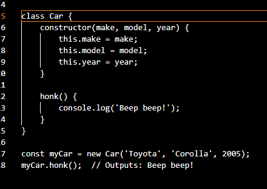
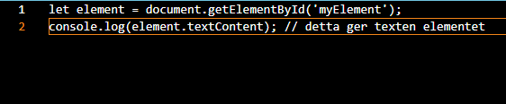
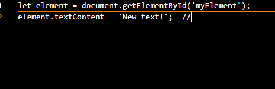
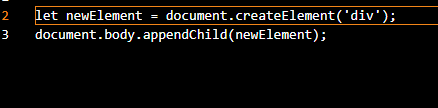
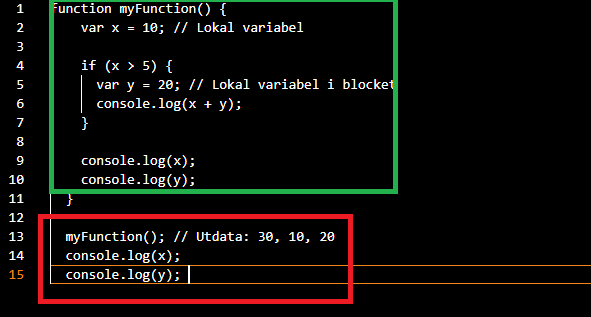
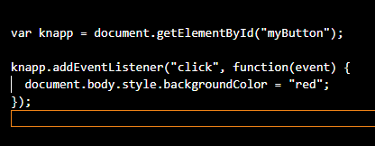
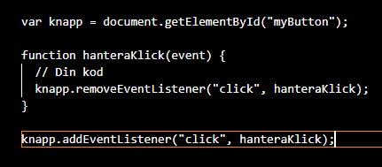
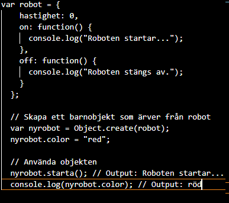
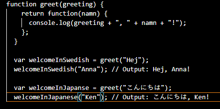
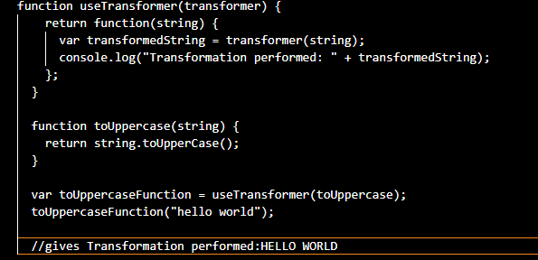

# Teorihandboken - JavaScript (JS)
Studerande: Vincent Wigardt

## JS 1.1 JavaScript / ECMAScript

Javascript är känt som ett ECMAScript som är ett popluilärt programmeringssårk för dynamiskt beteende och interaktivitet i webbplatser. Den officella standarden för JavaScript är ECMA som defineras av ECMA Internation-organisationen JavaScript var skappat frånbörjan att ge interaktivitet på webbplattser genom att göra det möjligt att manipulera HTML-dokument och även hantering av användarinteraktioner. Men idag används JavaScript inte endast för webbläsare utan också ute på servrar som tillexempel Node.js, mobilapputvecklingar samt IoT-appar en del funktioner samt egenskaper med JavaScript/ECMA script är att det är ett skriptspråk då JavaScript är ett högnivåskriptspråk som betyder att det är lätt att använda och är läsbart för människor och det kräver ej en kompilering och kan direkt köras i en webbläsaren eller en JavaScript-enigen. JavaScript använder sig av OOP objektorienterad programmering som betyder att den tillåter en att skapa objekt som har sina egna methoder och egenskaper den stödjer också polymorfism och även arv. Javascript är även dynamiskt typat som betyder att du inte behöver deklarera typen av data för en variablen innan du ska köra den där av typen bestämms per automatik när filen körs och det ger användaren flexibillitet men det kan då leda till oönskade beteenden om variablen identiferas på ett sätt som inte är önskat. JavaScript låter användaren att hantera event på webbläsaren då man kan använda sig av en funktion som kallas för eventlistener och den tilldelar händelserhanterare till HTML-element som kan vara inbakad i en knapp på din hemsida som reagerar varje gång användaren trycker på där man man kan tillämpa olika funktioner för att hantera eventet. Med Javascript kan du manipulera och ändra HTML-dokument då en DOM som betyder Document Object Model genom att komma åt och ändra elementen i DOMen vilket betyder att du kan uppdatera innehåll och layout på webbsidan dynamiskt. JavaScript stöder en async programmering med funktioner som promises eller callbacks eller async/away som möjlig gör att handskas med uppgifter som tar tid att köras tillexempel datahämtning ifrån server utan att rubba webbläsaren. JavaScript är även plattformsoberoende som betyder att den kan köras på olika webbläsaren samt plattformar och desktops som betyder att man kan bygga applikationer till en bred publik utan att skriva en separat kod för var plattform.

JavaScript bestrider ett ekosystem med massa olika  typer av biblotek och ramverk som underlättar produktionen av webbapplikationer. Vanliga ramverk som används är React, Vue.js och jQuery och mer. JavaScript har blivit en mycket en viktig del när det gäller modern webbutveckling eftersom att det gör det möjligt att skapa interaktiva webbapplikationer genom event hantering och DOM manipulation.

## JS 1.2 JavaScript-ramverk och -bibliotek

Ramverk och bibliotek är ett viktigt verktyg för utvecklare som finns för att underlätta arbetet när man ska skapa en applikation eller en webbsida som gör det snabbare och lättare att skapa genom ramverk och biblotek. Ett ramverk heter React och det är det populäraste Javascript ramverket just nu på marknaden som är utveckles av Facebook React har fokus på att bygga UI genom att delupp användargränssnittet i olika komponenter där React använder en virtuell DOM i en deklarerad syntax som gör det hantera UI updateringar genom rendering som gör att det går fort eftersom att React reagerar genom rendering och har ett stort uttbud av  verktyg och tillägg i bibloket för att göra produktionen snabb och smidig. 

Ett annat ramverk som använder Javascript heter Angular och är ett ramverk som är utvecklat av Google som erbjuder ett ett komplett verktygsset för att bygga applikationer där Angular använder sig av komponentbaserad system som ger stöd för datahantering, routing samt formulärvalidering, och har ett inbyggd stöd för TS, TypScript som erbjuder en statiskt typning för att ge en bättre utvecklings upplevelse. Ett annat ramverk som finns heter Vue.js som är ett ramverk som har fokus på skalbarhet och enkelhet. Som ger ett progressivt sätt att utveckla där du kan integrera Vue.js i ett projekt som redan finns. Vue använder sig av en komponent struktur med en enklare syntax som är kännt för att vara väldigt nybörjar vänligt efter som att den erbjuder en flexiblitet och känt för att det är lätt att lära sig språket pågrund av den lätta syntaxen.

Ett biblotek eller ett libary är en samling av kod som har olika typer av motoder, funktioner eller komponter som gör det mycket lättare att skriva applikationer många Javascript ramverk har sina egna bibliotek och verktyg för att göra det lättare att skriva i just det ramverket. Ett känt biblotek är jQuery som är ett JavaScript biblotek som har funnits länge och går att användas av många olika ramverk. Med den enkla syntaxen för välja och sedan manipulera element, hantera event och att köra animationer och skicka AJAX-requests. Det gör Jquerry poplärt inom webbutveckling och och går att använda genom olika JavaScript ramverk. Axios är också ett poplärt biblotek som gör det möjligt att gör HTTP requests från node.js eller webbläsaren som gör det enkelt att göra API-anrop där det används för att hämta data eller kommunicera med API:er oavsett ramverk. Lodash är ett poplärt verktygsbiblotek som ger många hjälpfunktioner för att handskas med data eller manipulera objekt eller arrayer och mer och den erbjuder en effeltiv method för vanliga uppgifter i JavaScript-utveckling oavsett ramverket som är valt. Med dessa exemplen av ramverk och biblotek kan vi kommafram till att det underlättar utvecklingen med JavaScript och valet av biblotek beror på vilket behov för funktioner du vill ha i ditt projekt och man får inte glömma att många JavaScript ramverk har sina egna biblotek.
## JS 1.3 Promises

Promises i JavaScript är en hanteringsmekaniskm för asynkrona operationer där promise ger ett resultat som inte är tillgängligt men är påväg att bli i framtiden vilket gör promises till en hanterbar method för asynkrona processer en Promise har tre olika tillstånd det första är Pending: och pending är ett tillstånd när en promise har skapat men reultat är inte tillgängligt. Fulfilled är ett tillstånd när en promise är klar med ett resultat och det sista tillståndet är Rejected och det är ett tillstånd som betyder att promisen har misslyckats. Promises har olika methoder för att hantera returs en av dom kan vara then() som används för att hantera ett lyckat promise sedan catch() använder man för att hantera en misslyckad promise och det används för att fånga och hantera fel i promise kedjan som är skapat. finally() är en callback funktion som alltid körs oavsett resultat och det används för att utföra avslutande åtgärder som till exempel att stänga resurer. Promises är en method för att hantera asynkrona operationer som gör det hänklarare att undvika callback-förvirrning och hantera situtationer oavsett om lyckat eller misslyckat.

I detta exemplet ovan har jag gjort en promise för API-hämtning som är begränsad med tid på 2000 sekunder.
Och här ser vi vid .then så får vi resultatet och .catch ger ett misslyckat resultat och .finally ger resultat av promisen oavsett om lyckat eller misslyckad där reslutat loggas is console.log.

Så med hjälp av konstruktören Promise är ett sett att hantera asynkron kod och resultatet, som en promise visar ett värde som är tillgängligt nu, senare eller aldrig och det används för asynkrona kedje operationer som ett HTTP-anrop eller att läsa eller skriva en fil där resultat inte är tillgängligt och kan även hantera så kallade callback hell där nivåer av callback-funktioner som är inbäddade som gör det svårare att läsa och uppdatera.

## JS 1.4 OOP i JavaScript

OOP då Objektorienterad programmering är en programmeringsparadigdm där obejekt används för att organisera och modellera data eller kod där objekten är inkaplade i klasser som man kan se som mallar för hur dom olika objekten ska vara och denna method används i större projekt när man måste kapsla in data i olika klasser. Finns många olika sätt att använda OOP som då kapsling där du kapslar in relaterade variabler och funktioner i ett objekt och det gör det lättare att organisera kod. Arv är en annan typ där en klass kan ärva methoder och egenskaper från en annan klass och detta gör det enklare att inte upprepa sig själv och gör att man kan återanvända kod som redan finns. En annan typ är Polymorfism vilket betyder att objekt kan hanteras som om de var samma typ och det gör det lättare för generella och flexibla operationer. Abstraktion gör att man döljer detaljer och ger nödvändig information som betyder att du kan dölja olika tillstånd och impementering och gör operationerna säkra och nödvändiga för olika komponenter i programmet.

I denna bild visar jag hur kapsling går till

Med kapsling så har jag slått datan och funktioner i en enhet. I denna bild har jag gjort det i ett objekt där en klass då Car som mall och sedan skapar man objekten i den klassen. var objekt har sin egna uppsättning av data som då attributs och kan utföra funktioner i methoderna för just den klassen.

En bra sak att vida är att Javascript inte har inbyggt stöd för egna egenskaper och methoder men det finns förslag att lägga till privata egenskaper och methoder i framtiden.

## JS 1.5 DOM-manipulation

DOM är ett programmeringsgränssnitt då API för HTML och XML filer där DOM ger strukturen på webbsidan och gör det möjligt för utvecklare att  manipulera innehållet stilen eller strukturen på webbplatsen med då JavaScript. När man ska manipulera en DOM med hjälp av JavaScript så har du möjligheten att läsa data från DOMen där du kan hämta information om elementet på platsen. Som att hämta text i ett element med en lista över alla andra olika element och deras typer eller ta reta vilken egenskap det har.

Så i exemplet så skickar den resultat i console.log

Och i nästa exmpel kommer jag visa hur man ändrar innehållet i DOMen.

Som ni ser med element.textContent kan jag ändra filen till "New text!"

Och hur man ändrar strukturen på domen där du kan lägga till eller ta bort eller ändra plats av elementen i detta exemplet lägger jag till en ny div

Och man ändra CSS stilen i ett element med detta exemplet.

 

Så i detta exemplet ändrar jag CSS stilen i dokumentet till red då röd.

I exmplet hämtar vi först elementet från DOM med IDet och sen ändrar vi texten i elementet där vi skapar ett nytt p element som sätter textinnehållet och lägger till barn till den. Sen manipulerar vi bakgrundsfärgen från det första elementet och sist lägger vi till en evenetlistner till det första elementet som triggar en alert när användaren klickar på den.

Så som vi ser är DOM-manipulation en method som gör det möjligt att göra interaktiva samt dynamiska sidor på webbplatser.

## JS 1.6 HTTP-requests

HTTP-requests är typ av protokoll som man använder för att hämta data eller skicka den genom olika requests. Särskillt när vi utevecklar för webben så används HTTP för att hämta och skicka data mellan servrar och just för den sakens skull finns det olika methoder då en av dom är `fetch` API, `XMLHttpRequests` och ett JavaScripts biblotek som kallas för `Axios`. Men iallafall är methoden `fetch` ett inbyggt API för webbläsarna och det ger oss tillgång att göra HTTP-requests.

HTTP-förfrågningar kan delas upp i olika delar då en av dom är Starten då den första raden i en HTTP-request som visar HTTP-methodens olika kommandon, Headers är nyckelvärden i förfrågan som ger en mer infomation och det finns olika typer av headers som kan vara `Authorization` som är vid authorisering `Content-Type` är då media typen av dess innehåll och sist Body är datan som skickas vid en förfrågan men vid en GET-request brukar det inte finnas någon body men i en POST eller PUT-requests är där man lägger datan som man vill skicka till servern. Så när man gör en frågan med då till exempel `fetch` .

Så i exemplet använder vi fetch för att koppa till apiet, och därefter använder vi methoden POST sen lägger vi till två headers då 'Content-type' och Autorization som då har en body som är en JSON sträng som sedan håller en promises kedja som först kollar om man får ok respons och om den är mer än 299 då returnar den som error. Att man kan styra HTTP-requests på detta sätt gör JavaScript ett bra val av språk för webbapplikationer eftersom att kommunicera med vilken server som helst och göra dessa förfrågningar.

## JS 1.7 Lexical scope

Lexikal scoping är ett koncept inom utveckling att som bestämmer tillgängligheten och synligheten av variabler och funktioner i ett program som då scopar en speciell del av koden och lägger en referens till positionen som den har inom en funktion eller ett block. Dom vanligaste typerna av scopes som används inom utveckling är:
Global skoping gör det möjligt att nå och använda det överallt i koden och local scoping skapas när en funktion eller kanske ett block defineras då både variablar samt funktioner har skrivits inut it en funktion eller block gör den endast synligt inom det scopet och då visas bara det som finns i det. I nästa exempel kommer visa lokal scoping

Så som vi ser är att variabeln x kan nås av både funktionen och inom blocket och variablen y kan bara nås i blocket.

Och det gör att man kan undvika konflikter mellan variabler som har samma namn och det tillåter en att hantera variabler och dess funktion på ett mer struktureratvis och genom det kan man hantera åtkomsten till dom och ge dom platser där dom behövs och det gör att man kan undvika namn konflikter och sedan förståa hur delarna av koden interagerar till varandra då block scoping är en typ av scoping som som inför blockbyggnader med loopar eller if-statments och då kan det definieras i då blocket. Man borde änvända lokala variablar så ofta som möjligt och unika globala variablar för att undika konflikter och även öka prestandarn i programmet genom att scopa saker lokalt eftersom att det krävs mindre minne i programet och procssorn kan ge mer kapacitet till programmet.

## JS 1.8 Event handling

Eventhantering är en viktig del inom JavaScript som gör att man kan ge sidan olika sätt a reagera på händelser händer i webbläsaren då avändaren klickat på en knapp eller skrivit sitt lösenord för att komma in på en hemsida en inloggningsfunktion och mer när man använder eventhantering kan man hantera händelser på hemsidan. Eventlistner då händelselyssnaren håller koll på händelser där man har nestat den i ett element som kan vara en knapp så kan man lägga till clickfunktionen och sedan kan man skriva vad som ska ske i koden efter klicket. En annan typ av funktion är event handling function som man skriver för att få en reaktion till klicket på sidan. I nästa exempel kommer jag att visa hur jag använder mig av eventlisten och en funktion som händer efter klicket.

Så i detta exemplet med hjälp av eventlistner triggas en funktion som ändrar backgrundsfärgen på sidan till röd när knappen trycks.

Hur man hanterar många event på samma gång kan man använda när man skriver en kod som ska köras med olika händelser till ett element som kan vara en funktion som kan vara att du vill avända en funktion för både click och mouseenter händelser. Vill du tabort eventlyssnaren så kan du enkelt göra det med `removeEventListner() sättet och det kan användas när man man tar bort en evenethanterare efter den har körts engång eller om du skulle viljka ändra något annat. I detta exemplet visar jag hur jag tar bort eventlyssnaren efter ett klick.

Eventhantering i JavaScript är en viktig och användbar del och ger en möjligheten till att kunna svara på händelser på en sidan som ger en interaktiv användarupplevelse på hemsidan.

## JS 1.9 Prototype inheritance

Prototypsbaserade arv fungerar som en mall för objekt och har egenskaper och methoder som ärvs till objektet. När ett objekt används och man vill få attributen eller methoden till den söker JavaScript först attributen eller methoden inom objektet och om det inte finns där letar så forsätter den att leta automatiskt till prototypen och på dett viset kan man bygga vidare eller återanvända prototypen. Eftersom att prototyparv får sina egenskaper och methoder från sin förälder och då barnet är något man kan forsätta skriva vidare på. I detta exemplet ska jag visa hur man kan använda det här.

Med methoden Objectcreate(robot) så återanvänder man variablen robot men gör ett nytt objekt med samma funktioner men har egenskapen red som färg.

När man gör ett objekt som får ära sin prototyps egenskaper gör det en länk mellan dom och det kallas för prototypskedja och det betyder att objekt som inte hittar sin egenskap eller method direkt i sig kommer JavaScript att söka efter prototypen och forsätta på kedjan till den har hittat egenskapen eller slutet av kedjan av prototyper. Vilket betyder att om man ändrar en egenskap eller en metod kommer då alla objekt ärva samma ändringar. Denna method är användbar när man vill skapa ett objekt med samma egenskaper och metoder och sedan ge dom ytterligare tillägg eller ändra egenskaperna eller methoden till barnobjekten. En sak som är också värt att namna är att det finns andra sätt att handskas med objektorientering och arv som klassarv med hjälp av class syntaxen och extends nyckelordet.

## JS 1.10 Higher-order functions

Higher-order functions är en funktion som är en speciell bit kod som gör något eget till exempel att ge en funktion ett värde att jobba med kan du också ge den en annan funktion. Higher-order funktionen tar emot en annan funktion och kan svara tillbaka med en funktion som resultat av det vilket betyder att man kan ta en funktion och bygga på den med en annan funktion som gör funktionen mäktigare.

I detta exemplet så är higher-order funktionen greet med variablen greeting som som huvud funktion och sedan återanvänds funktionen greet med samma funktion som greeting till den nya variablarna då man återkallar funktionen i dom och sedan ger dom värden att interagera med för att ge nya resultat. Det betyder att man kan göra funktioner mer avancerade då man kan ta emot en funktion som redan finns. Det kallas även för funktioner av den första klassen.

I detta exemplet skapar jag en funktion ifrån grund funktion som gör att den säger HELLO WORLD med stora bokstäver + grundfunktionen useTransformer. då resultat blir Transformation perfored: HELLO WORLD. 

Som vi märker att denna typ av method ger flexibiltet och enkelhet när man ska skriva funktioner man kan ockå separera ansvar genom att ge dom olika ansvarsområden med högnivåsfunktior som tarhand om det för just vissa uppgifter och det gör koden lättare att kunna läsa och updatera det ger oss möjlighet att kedja funktioner till varandra och använda dom. Higher-order functions ger oss ett sätta att skriva mera komplexa funktioner som man kan utveckla.
## JS 1.11 Single-thread programming

Single-thread programming eller entrådad programmering är en programmeringsmodell där ett projekt då en applikation eller en webbsida körs i en enkel körningstråd vilket betyder att en sak körs i sin tur och ordning vilket betyder att varje sak körs i sin ordning tills dom får sin tur i kön. Enkeltrådad miljö finns i språk som Javascript där det är vanligt att köra en sån typ av tråd eller sekvens.  Synchronicity är ett koncept som betyder att en sak ska göras åtgången vilket betyder att var uppgift ska bli klar innan nästa ska köras. Det kan man använda för att skapa ordning och dela upp uppgifter där det ska ske i ett händlse förlopp. Om en uppffitar tar för mycket tid kommer hela programmet stanna upp tills den är klar  och det kallas blockering och det kan göra att platsen inte ger något svar eller fryser. Men med hjälp av asynkrona funktioner som tillåter programmet att fortsätta köra andra uppgifter medans den uppgiften som är blockerad körs. Event-loop är ett annat sätt som man kan göra för att undvika blockering och den hanterar händelserna efter deras resultat. Som vi märker finns det för och nackdelar med detta sätt att skriva kod då fördelen kan vara att att skriva kod i ett enkelt ästt med inget behov av trådsäkerhet eller risk för uppstående konflikter av andra trådar och då nackdelan kan vara att sättet kan blockera programmet för att den hackar upp sig på en uppgift. Därför är det viktigt att veta vad man ska göra när man ska nyttja denna teknik och veta hur man ska handskas med dom potitenalla riskerna med att skriva på ett enkelttrådat vis. 

## JS 1.12 OAuth från frontend

När det gäller autenisering i JavaScript finns det två olika methoder som man kan använda en av dom är då session eller token baserade en session method är när en användaren skriver sitt användarnamn och lösenord och där av så verifierar servern värderna som användaren skriver och därav skapas en session variabel som lagras oftast på servern och den har sitt egna id för sessionen och då sparas den i minnet på klientenssida eller eller i en cookie. Det gör att servern kan tolka IDet och låta eller neka baserat på om sessionen är lämplig eller inte. Autentisering med tokens gör att en token genereras som kan vara en JSON Web Token JWT när användaren av webbsiodan har blivit autenserad så skickas en token till klienten och lagras där med som en cookie eller Web Storage. För var begäran från klienten som har dessa tokens så läggs en begäran som server kan sedan svara på om den är validerad eller inte. autentisering med token ger hemsidan skalbarhet och en stateless lösning om man jämnför sessions där man inte behöver att lagra state av sessisonerna eftersom att man använder sig av ett API kall till servern där tokensarna lagras. Det finns många sätt att autensera sig på webben med hjälp av biblotek ett exempel är OAuth 2.0 som är token baserat för att implementera OAuth kan man göra det med node.js och ladda ner ett biblotek eller en SDK som fyller dina säkerhets behov. Sedan registerar man sig till den OAuth leveratantören man vill ha där man får ett klient-ID och hemlighet till den som kan sedan användas till applikationen. För att koppla det till din applikation använder du ditt klientid och hemligheten som du har fått för att verifiera dig till deras webbserver genom ett API som går till dom. Sen måste man skriva åtkomst punkterna för autensiering till Oauth-leverantören. Så när autentiseringen är lyckad via OAuth-leverantör får användaren ankomst till sidans URL och där genereas en autentiseringskod eller en token och detta kan man göra med hjälp av OAuth paketet. När en token är genererad av en användaren kan man sedan göra en autentiserad API call till leverantören. Därför är det viktigt att lösa dokumentationen has leverantören av OAuth innan man använder den och ger den felaktiga instruktioner.

## JS 1.13 Websockets

Websockets är en ett typ av protokoll som HTTP men använder en teknik för då tvåvägskommunikation mellan klienten och servern. Det ger nutids kommunikation med en fast anslutning från klient till server. Eftersom att den är ständigt ansluten genom en handshake-process som betyder att klienten och servern är överens att använda just Websocketprotokollet. När man är anslutet förblir den öppen som en kopplingslänk mellan klienten och servern. Eftersom att en WebSocket har Tvåvägskommunijkation kan både klienten och servern skicka data mellan varandra utan att behöva vänta på request från klienten som betyder att båda kan skicka och ta emot meddelanden mellan varandra som ger nutids kommunikation. Som är en bra lösning för till exempel chatsidor där man behöver realtids kommunikation utan att behöva kolla efter updateringingar på servern. Websockets är även ett typ av protokoll som använder ett binärt protokoll för att minimera overheaden goch ge mer effekt på dataöverföring. Kan hantera kommunkationer runt olika domäner med hjälp av CORS som betyder Cross-Orgin Resource Sharing genom att använda HTTP-Headers och sedan granska tillståndet för att forsätta eller begränsa anslutningen mellan klienten och servern.

I JavaScript använder man WebSockets genom ett API som finns inbyggt i våran webbläsare då APIet ger methoder för att utföra operationer för att skapa, skicka, ta emot eller att avsluta genom en Websocket anslutning. Vilket betyder att WebSocket är användbart i applikationer som kräver realtidsuppdateringar, som då spel, chattsidor eller finanssystem. Apiet för WebSockets när den är ansluteten onopen är när anslutningen är öppen och onmessage är när när man har fått ett medelande och onclose är när uppkopplingen stängs och onerror är vid fel. sen finns det methoder som då send() för att skicka data till servern och close() för att stänga anslutningen till servern.

Som vi ser har WebSiockets många användsmöjligheter för applikationer som behöver nutid kommunikation som spel, chatsidor eller något dylikt som kräver realtidskommunikation.
